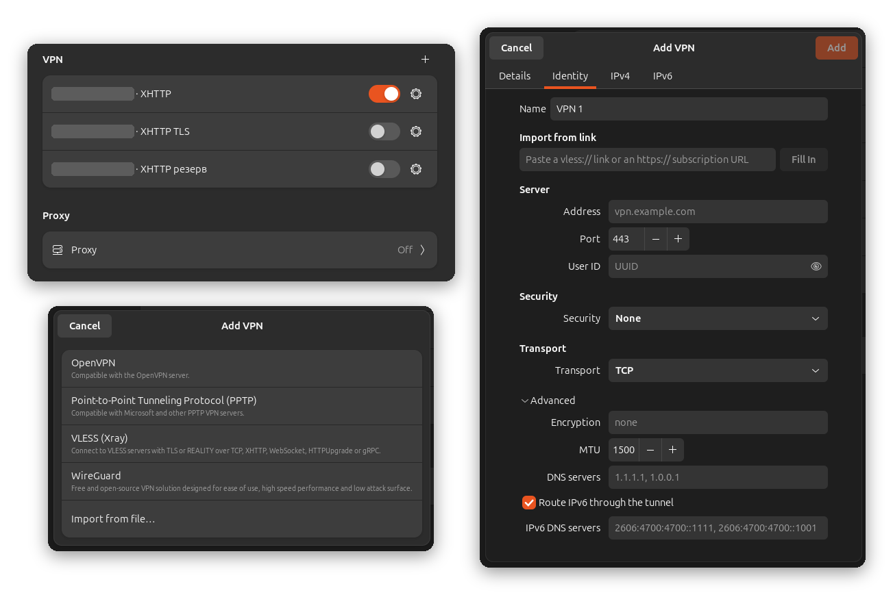

# NetworkManager-vless

[](https://github.com/s11va9/network-manager-vless/actions/workflows/ci.yml)
[](https://github.com/s11va9/network-manager-vless/releases/latest)
[](https://github.com/s11va9/network-manager-vless/releases)
[](LICENSE)

A [NetworkManager](https://networkmanager.dev/) VPN plugin for **VLESS** connections,
powered by [Xray-core](https://github.com/XTLS/Xray-core).

VLESS servers become ordinary VPN connections: add them in GNOME Settings, switch them
on and off in Quick Settings next to Wi-Fi and control them with `nmcli`. Routes, DNS
and reconnects are handled by NetworkManager like for any other VPN.

**[Download the latest release](../../releases/latest)** · [Installation](#installation) ·
[Русская версия](README.ru.md)

<p align="center">
  
</p>

## Features

- **GNOME Settings integration**: "VLESS (Xray)" in the Add VPN dialog, an editor for
  every setting and "fill in from a `vless://` link". English and Russian interface.
- VLESS over TCP (with XTLS Vision), XHTTP, WebSocket, HTTPUpgrade and gRPC; TLS and
  REALITY.
- Full tunnel for IPv4 and IPv6 through a TUN device, DNS inside the tunnel without
  leaks through the physical network. The tunnel's routes win over other VPN clients'
  default routes, and another client's local system proxy is turned off while VLESS
  is connected, so browsers, terminals and other applications all use the tunnel.
- Automatic restart of Xray-core if it exits while connected.
- Subscriptions with automatic updates that keep your per-connection changes.
- **One package**: Xray-core is included, verified against the upstream checksum.
- Privilege separation: Xray runs as an unprivileged user with no capabilities.
  Credentials are stored by NetworkManager and never written to logs.

## Installation

Download the package for your architecture from the
[latest release](../../releases/latest) (`amd64` for most PCs, `arm64` for ARM
devices) and open it: on Ubuntu, double-clicking a `.deb` opens it in App Center.
Alternatively, install it from a terminal, which also installs the dependencies:

```sh
sudo apt install ./network-manager-vless_0.5.0_amd64.deb
```

That is all: NetworkManager picks up the plugin immediately, no reboot or
configuration is needed. Supported: Ubuntu 24.04 or newer and other distributions with
NetworkManager 1.24+, GTK 4.6+ and Python 3.11+.

If GNOME Settings was running during an installation or update, restart it: it keeps the
previously loaded plugin in memory (also in the background, for the search in the
Activities overview). `pkill -x gnome-control-c` stops it; the next start loads the new
version.

To remove it: `sudo apt remove network-manager-vless`.

## Usage

### GNOME Settings

1. Open **Settings → Network**, click **+** next to **VPN** and choose **VLESS (Xray)**.
2. Paste your `vless://` link into **Import from link** and click **Fill In**, or enter
   the server settings manually.
3. Give the connection a name and click **Add**.

The connection now appears in the VPN list and in the Quick Settings menu. The ⚙ button
opens the same editor later.

**Subscriptions:** paste an `https://` subscription URL into the same field and click
**Add Subscription**. Every server of the subscription becomes its own VPN connection
and is kept up to date automatically; close the Add VPN dialog afterwards.

A text file containing a link can also be imported with **Import from file…** in the
Add VPN dialog.

### Command line

```sh
nm-vless import -                    # paste a link; it is not echoed or stored in history
nmcli connection up "My server"
nmcli connection down "My server"
nm-vless list                        # connections, * marks active ones
nm-vless export "My server"          # print the vless:// link
nm-vless check                       # verify the installation
nm-vless test "My server"            # check that sites open through it (no VPN needed)
```

### Subscriptions

```sh
nm-vless subscription add -          # paste the https:// URL
nm-vless subscription list
nm-vless subscription update
nm-vless subscription remove NAME    # also deletes its connections
```

Subscriptions are updated automatically at the interval the provider requests
(`profile-update-interval`, 6 hours by default); a timer checks every hour
(`systemctl --user list-timers nm-vless-subscriptions.timer`). Updates add new servers,
update changed ones (keeping the connection UUID and your settings such as autoconnect)
and delete servers that disappeared. An active connection is never deleted, and a
response without any usable server changes nothing. Before 0.5.0, updates on Ubuntu
added every server again (netplan lost the mark that links a profile to its
subscription); the first update with 0.5.0 keeps the copy you used last and deletes the
other copies. Some providers only serve clients
with a specific User-Agent; use `--user-agent` in that case.

### Advanced options

MTU, DNS servers and IPv6 routing are in the editor's **Advanced** section, or:

```sh
nmcli connection modify "My server" +vpn.data "mtu=1400, dns=9.9.9.9, ipv6=no"
```

All keys are documented in [docs/connection-settings.md](docs/connection-settings.md).

## How it works

```text
GNOME Settings / Quick Settings / nmcli
                │ D-Bus
                ▼
         NetworkManager ──────────── addresses, routes, DNS on the TUN device,
                │                    route to the server outside the tunnel
                │ starts per connection
                ▼
  nm-vless-service (root) ── creates TUN device ──┐
                │ spawns via setpriv               │ XRAY_TUN_FD
                ▼                                  ▼
       xray (user nm-vless, no capabilities) ──── VLESS ───► server
```

The service resolves the server before the tunnel exists and reports its address to
NetworkManager as the VPN gateway; NetworkManager routes exactly that address through
the physical interface, so Xray's own connection never loops into the tunnel. Besides
the default route, the tunnel gets `0.0.0.0/1` and `128.0.0.0/1` (`::/1` and
`8000::/1` for IPv6), which are more specific than any default route, so traffic uses
VLESS even while another client's tunnel is up. To use VLESS only for its own network,
turn on "Use this connection only for resources on its network" on the IPv4/IPv6 pages
(`ipv4.never-default yes`).

`nm-vless-proxy-guard.service` runs in the desktop session: while a VLESS connection
is up and the GNOME system proxy points to a local proxy of another client (for
example Happ's `127.0.0.1:10809`), it turns the system proxy off and turns it back on
afterwards. Turn this off with
`systemctl --user disable --now nm-vless-proxy-guard.service`. Details are in
[docs/architecture.md](docs/architecture.md).

## Troubleshooting

```sh
nm-vless check
nm-vless test "My server" https://example.org/     # sites through the server, no VPN needed
journalctl -b -t nm-vless-service                   # service and xray messages
resolvectl status                                   # DNS servers per interface
ip route get 1.1.1.1                                # should use the vless* device
```

### Some sites open and others fail with "connection closed"

Browsers report `ERR_CONNECTION_CLOSED` (Chromium logs `handshake failed … net_error
-100`) when the tunnel accepts a connection but the server does not forward it.
`nm-vless test` shows which sites the server reaches and the country traffic leaves
from, without connecting the VPN:

```sh
nm-vless test "My server" https://mail.google.com/ https://claude.ai/
```

If some sites fail there too, the server or its hosting provider blocks them: use
another server. If everything works in `nm-vless test` but not with the VPN
connected, make xray log every failed connection and try again:

```sh
sudo nmcli general logging domains DEFAULT,VPN_PLUGIN:DEBUG   # reconnect the VPN after this
journalctl -b -t nm-vless-service -f
sudo nmcli general logging domains DEFAULT                    # back to normal
```

Debug logs contain the addresses you connect to; do not post them publicly.

### Opening a connection in Settings is slow

Versions before 0.4.0 had no authentication helper, and GNOME Shell's secret agent
made every secrets request wait 25 seconds. Update the package and restart GNOME
Settings.

### Some applications do not use the VPN

`nm-vless check` detects the two usual causes after switching from another client:

- **Another client's tunnel routes half of the address space** (`0.0.0.0/1`, as
  OpenVPN's `def1` does) with a better metric. A plain default route of another client
  no longer matters. Disconnect or quit the other client.
- **The system proxy points to another client's local proxy** (for example
  `127.0.0.1:10809`) and `nm-vless-proxy-guard.service` is not running. Browsers,
  Electron and GNOME applications then talk to that proxy directly. Start the guard
  (`systemctl --user enable --now nm-vless-proxy-guard.service`; it starts by itself
  after the next login) or turn the proxy off in **Settings → Network → Proxy**.
  Applications that were already running may keep the old proxy (Claude Desktop, for
  example, passes it to its child processes as `HTTPS_PROXY`), so restart them once.
- **`HTTP_PROXY`/`HTTPS_PROXY`/`ALL_PROXY` point to a local proxy** in the
  environment. Command-line tools use them and fail once that proxy is gone. Remove
  them from wherever they are set and restart the programs.
- **DNS queries leave the tunnel** with profiles created before 0.4.0. `nm-vless check`
  prints the `nmcli` command that fixes each of them; profiles from subscriptions are
  also fixed by the next `nm-vless subscription update`.

| Message | Cause |
|---|---|
| `must be owned by root and not writable by others` | the xray binary or one of its directories has unsafe permissions |
| `version 26.6.22 or newer is required` | a system-wide Xray-core is used and it is too old |
| `xray did not start within 20 seconds` | see the `xray:` lines in the journal |
| `running xray as root` warning | the `nm-vless` user is missing: `sudo systemd-sysusers` |

## Limitations

- Only VLESS; VMess, Trojan, Shadowsocks and Hysteria2 links in subscriptions are
  skipped and reported.
- All traffic goes through the tunnel; split routing is not supported yet.
- `allowInsecure` (TLS without certificate verification) is intentionally rejected.
- Encrypted provider links such as `happ://crypt…` are proprietary and cannot be read.
- The editor needs GTK 4 (GNOME Settings); the GTK 3 `nm-connection-editor` can
  activate VLESS connections but not edit them.

## Roadmap

1. Routing rules (direct domestic traffic, geoip/geosite).
2. Other protocols supported by Xray-core.
3. An APT repository for automatic updates.

## Development

Building from source, tests and releases are described in
[docs/development.md](docs/development.md). See also [CONTRIBUTING.md](CONTRIBUTING.md);
report vulnerabilities privately as described in [SECURITY.md](SECURITY.md).

## License

GPL-2.0-or-later, like NetworkManager and its other VPN plugins. See [LICENSE](LICENSE).
The package includes an unmodified Xray-core binary, licensed under MPL-2.0; its
source is available at <https://github.com/XTLS/Xray-core>.
